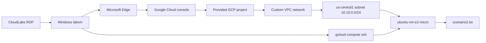

# Compute Engine Basics

## Welcome

In this lab, you will create and verify a Linux virtual machine in Google Compute Engine, then connect to it from the prepared Windows lab VM by using `gcloud compute ssh`. You will finish by creating a completion file in the default Linux user's home directory.

The lab is performed in the CloudLabs-provided Google Cloud project. The deployment provisions the Windows `labvm`, a dedicated VPC network, a `us-central1` subnet, and the SSH firewall dependency. You create the assessed Linux VM yourself; it is **not** provisioned for you.

**Estimated duration:** 90 minutes

## Sign in and open the lab environment

1. In the CloudLabs portal, open the connection details for the Windows lab VM named `labvm` and start an RDP session. Use the RDP credentials supplied by CloudLabs.
2. When the Windows desktop appears, locate the Microsoft Edge shortcut created by the lab bootstrap. Open the shortcut to launch the Google Cloud console at <https://console.cloud.google.com>.
3. Sign in to Google Cloud with the credentials supplied for this lab:
   - **Email:** <inject key="GcpUserEmail"></inject>
   - **Password:** <inject key="GcpUserPassword"></inject>
4. In the Google Cloud console project selector, select project **<inject key="GcpProjectId"></inject>**. Confirm the project ID before creating any resources. You can also confirm it from PowerShell on `labvm` using the project ID shown above:

```powershell
gcloud config set project PROJECT_ID_SHOWN_ABOVE
gcloud config get-value project
```

If the project selector or `gcloud` reports a different project, stop and correct it before continuing. Do not use a personal Google Cloud project.

## Prerequisites and prepared resources

Before starting Exercise 1, confirm the following:

- You can interact with the Windows `labvm` through RDP.
- Microsoft Edge opens the Google Cloud console.
- The provided Google Cloud identity can create Compute Engine VM instances and view the prepared network resources.
- `gcloud` is available in PowerShell on `labvm` and is authenticated for the provided project.
- The deployment has prepared a custom-mode VPC network with a subnet in region `us-central1` and IPv4 range `10.10.0.0/24`.
- A TCP port 22 ingress rule is prepared for the learner VM's expected network tag. This is intentionally broad, lab-only SSH access; do not copy this exposure pattern to production.

The deployment-specific network and subnet names are available in the Compute Engine network selection controls. Use the network whose subnet is `10.10.0.0/24`; do not select an unrelated default or personal network. If the lab portal displays the deployment identifier, it is **<inject key="DeploymentID" enableCopy="false"/>**.

## Fixed values for this lab

Use these values exactly when the console asks for them:

| Setting | Required value |
|---|---|
| VM name | `ubuntu-vm` |
| Zone | `us-central1-a` |
| Region | `us-central1` |
| Machine type | `e2-micro` |
| Boot image | Latest Ubuntu LTS image available in the console |
| VPC network | Deployment-specific custom VPC prepared for this lab |
| Subnet | Prepared `us-central1` subnet with `10.10.0.0/24` |
| External IPv4 | Ephemeral |
| SSH network tag | The tag expected by the prepared TCP/22 firewall rule |
| Completion file | `scenario2.txt` in the default user's home directory |
| Completion content | `scenario 2 is completed` |

The VM must be running after creation. Record its ephemeral external IPv4 address from the instance details page; Exercise 2 uses the VM name and zone, while the address helps you verify connectivity.

## Architecture



The VM uses an ephemeral external IPv4 address so the SSH workflow from `labvm` can reach it. The prepared firewall rule permits TCP/22 for the expected learner tag. `gcloud compute ssh` manages the SSH key workflow and translates the instance name into a reachable address; the command still requires the correct zone and network readiness.

## Lab sequence

### Exercise 1 — Create the Linux Compute Engine VM

Use the Google Cloud console to create `ubuntu-vm`. Choose zone `us-central1-a`, machine type `e2-micro`, the latest Ubuntu LTS image available, the prepared VPC and `10.10.0.0/24` subnet, an ephemeral external IPv4 address, and the expected SSH network tag. Verify that the instance is running and record its external IP.

### Exercise 2 — Connect and create the completion file

Return to PowerShell on `labvm`, confirm the project, and run `gcloud compute ssh ubuntu-vm --zone us-central1-a`. Accept first-connection or SSH-key prompts when shown. In the Linux session, use `$HOME` rather than a hard-coded username to create `scenario2.txt` with the exact line `scenario 2 is completed`. Verify the path and content, then exit the SSH session.

If SSH is initially unavailable, wait briefly for the VM and firewall configuration to become ready and retry. If key propagation is still pending, retry the command or use its `--troubleshoot` option. Confirm that the VM is running, the external IP is present, the expected network tag is attached, and TCP/22 is permitted before escalating the issue.

## References

- [Google Cloud Console](https://console.cloud.google.com)
- [Create and configure a Compute Engine instance](https://cloud.google.com/compute/docs/instances/create-start-instance)
- [Connect to Linux VMs using Google Cloud CLI](https://cloud.google.com/compute/docs/connect/standard-ssh)
- [`gcloud compute ssh` reference](https://cloud.google.com/sdk/gcloud/reference/compute/ssh)
- [VPC firewall rules](https://cloud.google.com/firewall/docs/firewalls)

## After publishing

> [!Note] These steps run **after** you push the template to CloudLabs — they verify CloudLabs can actually serve this lab guide to candidates.

- **Verify docs-proxy access:** open Templates → your template → **Lab Guide Settings** in <https://admin.cloudlabs.ai> and confirm CloudLabs can reach this repo via the docs proxy. If the repo is private, configure GitHub access at the template level.
- **Verify inline questions and inline validations:** sign in to <https://admin.cloudlabs.ai>, open your template, and walk through one full lab run to confirm every `<question>` and `<validation step="..."/>` renders correctly. Fix any that don't resolve.
